# Semester 2: Part 2 Initial

The following is the first presentation during the start of Spring 2024.

## Copyright and Protection Disclaimer

**Copyright Notice:**

The content and images presented in these slides are the intellectual property of Kushagra Srivastava. All rights are reserved. The reproduction, distribution, or utilization of any part of these slides without the prior written consent of Kushagra Srivastava is strictly prohibited.

**Protected Material:**

These slides are part of Kushagra Srivastava's Honors Thesis. The information and materials contained herein are protected under intellectual property laws. Any unauthorized use, reproduction, or distribution may violate copyright, trademark, and other laws.

**Usage Authorization:**

If you wish to use or reproduce any part of these slides for educational or non-commercial purposes, please contact [Kushagra Srivastava](https://skushagra.com) for authorization.

The code will be released under GNU GPL v3 once ready.

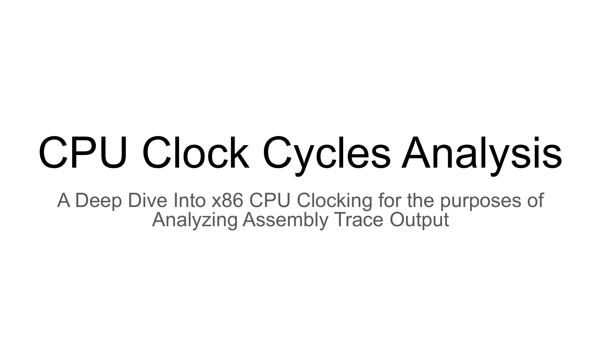
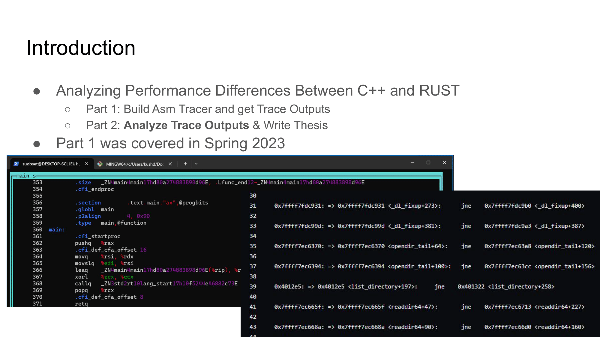
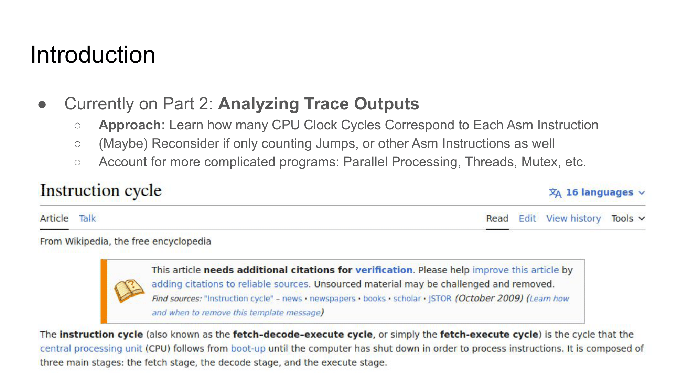
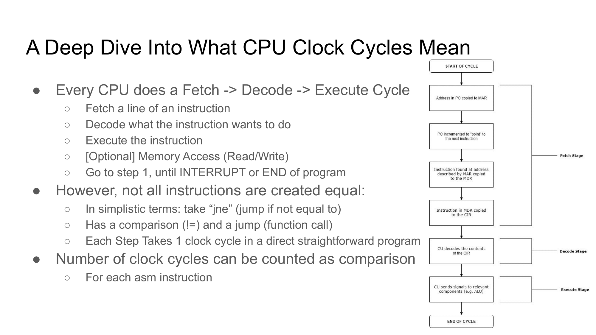
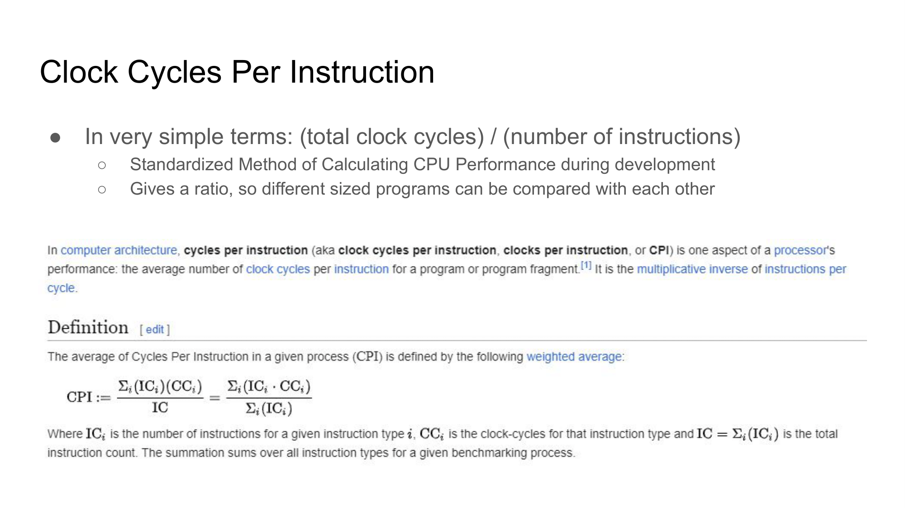
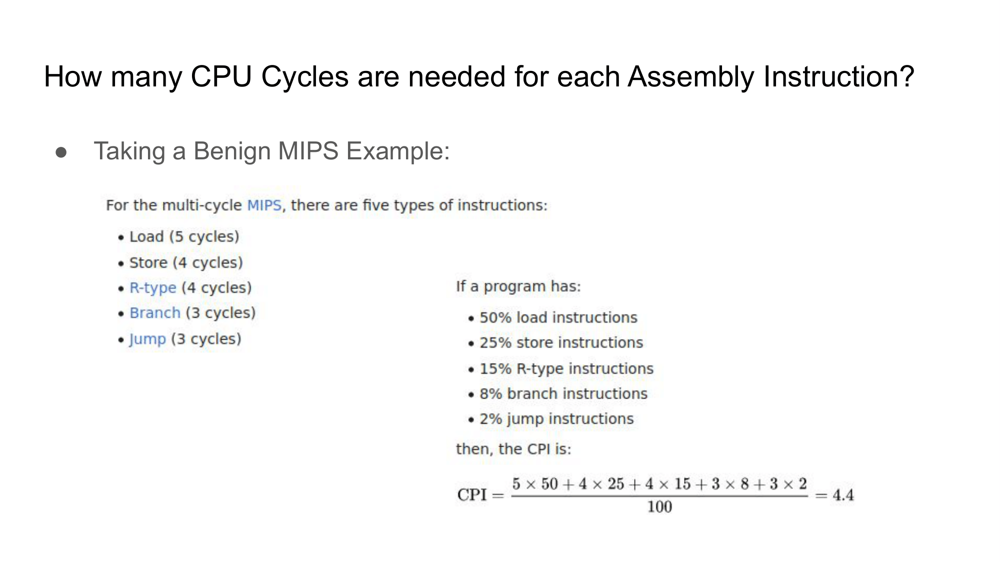
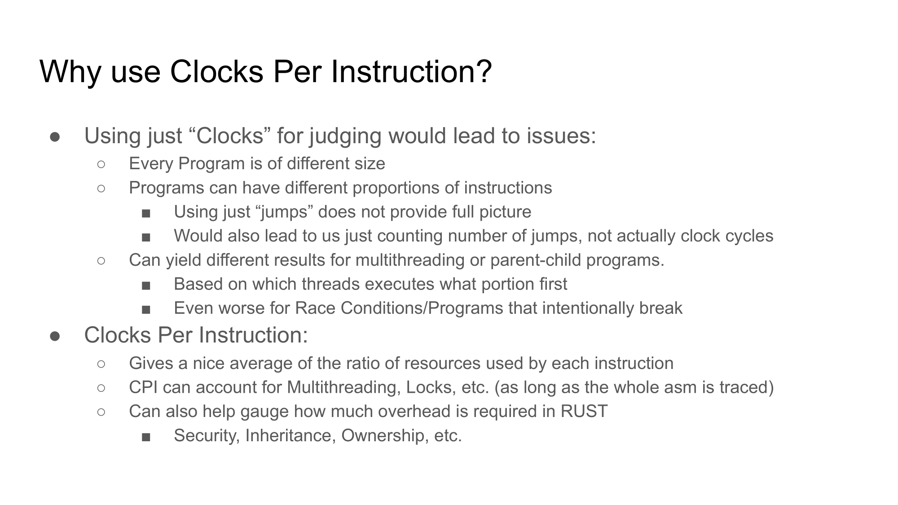
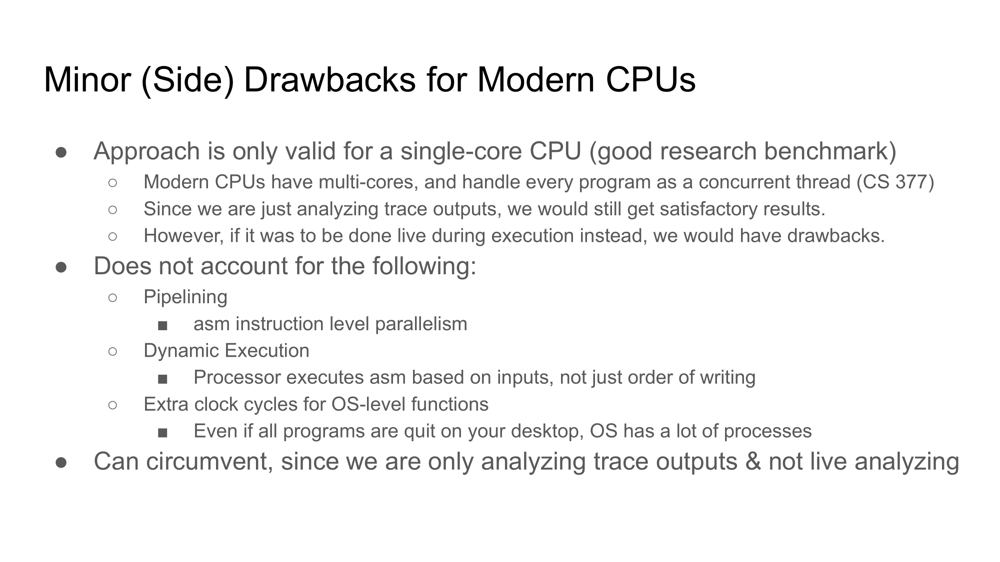
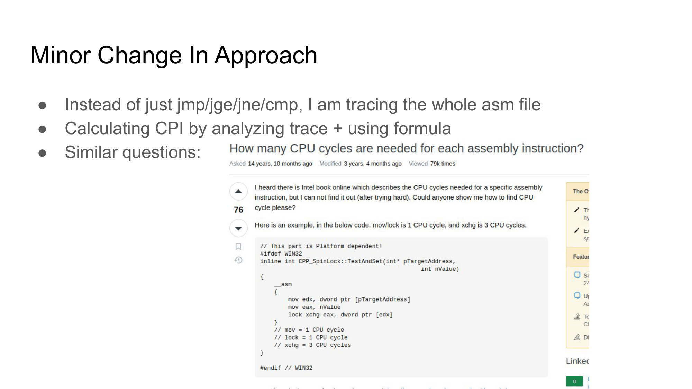
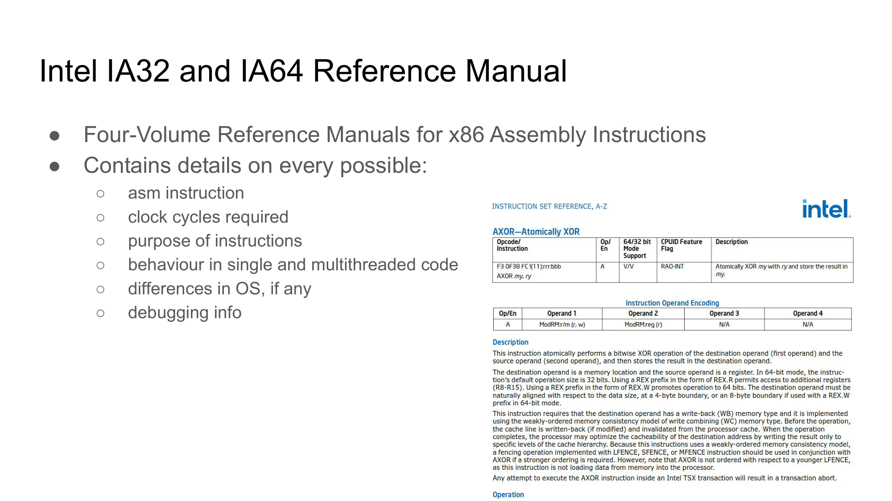
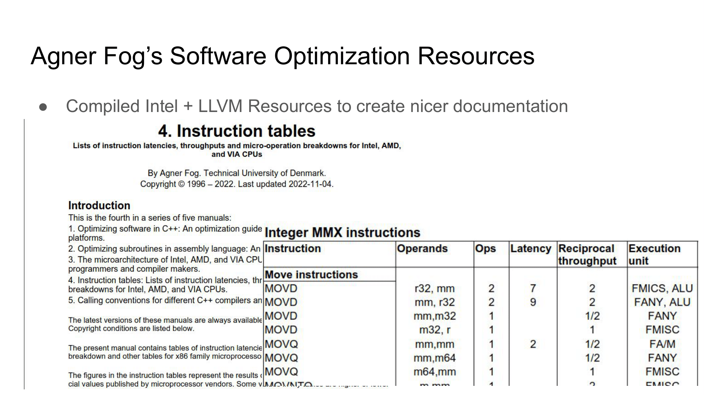
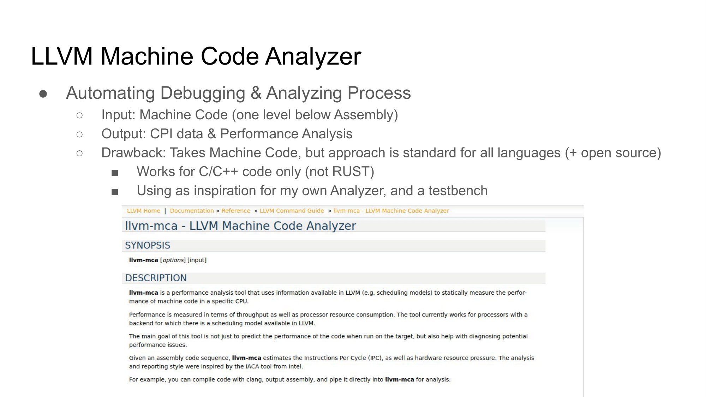
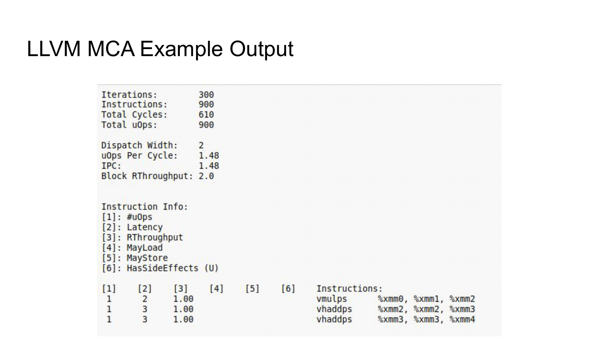
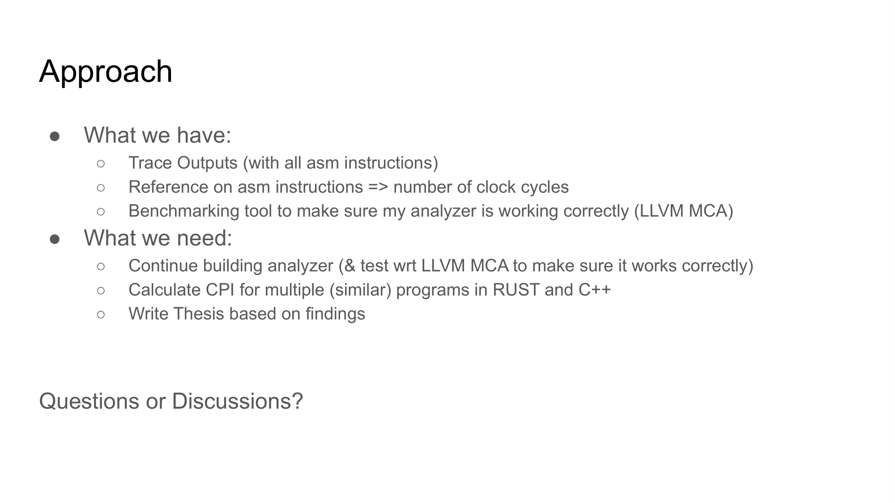