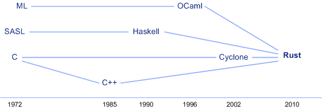
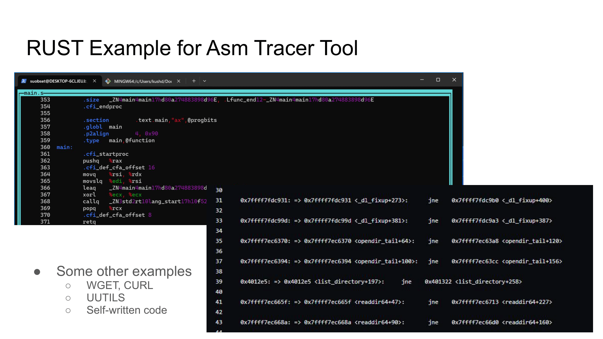

Disclaimer: All general-purpose graphics on this page were generated using [Microsoft's Bing AI](https://bing.com). For graphics taken from a specific source (such as charts), appropriate citation (including self-citation) has been given below the same.

# Why is this project significant.


The following project, while accessible to everyone, is mainly targeted towards the millions of developers creating digital products on the daily. We attempt to reform low level systems in servers and mainframes, in an effort to have userland applications work more efficiently, increase server bandwidth, and give a little bit back to the environment.

Let's dive a little bit into each of these:

## First, Some Background

This project attempts to compare and contrast performance differences between RUST and C++, two low level languages that were created at different points of time, and with different goals in mind.

While C++ was developed as an incremental upgrade to C, it follows a lot of compiler conventions from the 90s and has not changed much in structure. C++ is prone to various errors if users are not mindful: memory leaks, segmentation faults, kernel errors, and so on. Moreover, being an incremental upgrade to an already old language, C++ can sometimes not be the most efficient language out there.

On the other hand, we have RUST: a language whose development started in 2010, and is continuing today. RUST attempts to employ stricter typesetting, better error tracking, and more stringent memory usage to run more efficiently.



Credits: [IBM: Why You Should Learn The RUSt Programming Language.](https://developer.ibm.com/articles/os-developers-know-rust/)

This is not to say that C++ is a "bad, outdated language". Simply put, most low level systems today still run on C++, mainly because the cost of refactoring to RUST is enormous, and benefits unknown.

By comparing the performance differences between the two languages, we can determine the Return on Investment, should an undertaking be made to refactor code into the new language.

## Hypothesis 1: Environmental Impacts

According to [Energy Innovation](https://energyinnovation.org/2020/03/17/how-much-energy-do-data-centers-really-use/), global data centers consumed about 205 terawatt-hours (TWh) of electric power, or about 1% of Global Consumer Electricity Consumption.

Let us put this in perspective: given the world population, servers alone accounted for the electricity that would have been used by 70,000,000 people. This number is about twice the population of Canada, about 65% of Mexico's Population, and about 4 times the population of Australia.

Now, let us assume (hypothetically), that we have moved all low level systems to RUST, which means that all servers in the world run on RUST now. While this is a bit flawed in its nature, let us also assume that there is a direct co-relation between energy consumption and the effectiveness of a language.

If RUST enables, through it's various carefully-constructed safety paradigms, about 5% more efficiency in servers, this would result in savings of about 10.25 terawatt-hours of electricity. That number is greater than the electricity used in about [119 countries of the world](https://en.wikipedia.org/wiki/List_of_countries_by_electricity_consumption), even while having taken only conservative metrics, since inter-connection of servers through Networking, and a higher efficiency of consumer electronics (or client devices) has not been taken into consideration.

RUST would enable the same infrastructure to server exactly the bandwidth it is serving currently, while automatically providing back electricity worth of powering such a high number of countries. Moreover, the same infrastructure can also be utilized into serving an even higher bandwidth without putting new hardware into place, thus providing immense future-proofing and reliability.

## Hypothesis 2: Lower the Barrier of Entry to Low-Level Development

Low Level Systems: including, but not limited to, CPU/GPU Architectures, Compilers, Operating Systems, Networking Interfaces, Communication Protocols, and the like are a culmination of decades of work, most of which really gained traction in 1970s. As a result, there exists a high amount of legacy code, which can be unreadable and intimidating: thus making the development process inaccessible to many.

The manner in which languages such as C/C++ behave can also differ between systems, which is a result of the time that they were created in. Free/Libre, or Open Source software did not quite exist: which meant that companies shipping computer systems had full control over how a certain language would behave on their system. As a result, C behaves differently on different kernels, even today.

There are currently tremendous amounts of versions of C in circulation, and this is before we get into the forks of this language (such as Arduino-C, Objective-C, C#, and so on).

RUST was developed from day 1 as an open source project, placing proper standardization across platforms. RUST behaves exactly the same, on every single piece of hardware. Thus, this lowers the barrier of entry incredibly. Paired with incredible documentation, and a unified compilation process on every system, RUST makes low level development significantly easier to novices and professionals alike.

On top of C++, RUST provides the following benefits (from the [RUST Documentation](https://doc.rust-lang.org/rustdoc/what-is-rustdoc.html)):

* RUST has a more strong typesetting that prevents common errors such as NULL Pointer referencing, memory leaks, buffer overflows, and race conditions. Using the concept of ownership and borrowing to manage memory and resources during compilation, RUST can theoritically execute equally complex programs while using lesser resources.
* RUST allows for more concise code, which makes readability easier for developers. Since low level systems get super complicated to execute even the most basic operations, the cleaner code syntax of RUST is crucial for continued development with the shortest learning curve. The syntax allows for less complexity, thus allowing for updates in low level code at a faster pace.
* RUST is designed for parallel processing and concurrency, which means that any code written is extensible to any system imaginable: ranging from a Raspberry Pi to an IBM Mainframe.

** Security Example: Race Conditions: **

For example, here are code snippets in C and Rust that deliberately create a race condition, highlighting how C++ allows it while Rust prevents it with an error.

A race condition is a software flaw that occurs when the behavior of a program depends on the timing and order of execution of multiple concurrent operations, leading to unpredictable and often unintended outcomes. We will see a live version of said unpredictable outcomes with C++, and see how RUST fixes this flaw.

Let's start with C++:

```c
// Race Condition Demo, written by Kush.
#include <stdio.h>
#include <stdlib.h>
#include <pthread.h>

int shared_variable = 0;

void *increment(void *arg) {
    for (int i = 0; i < 1000000; i++) {
        shared_variable++;
        }
        return NULL;
        }

        int main() {
            pthread_t thread1, thread2;

            if (pthread_create(&thread1, NULL, increment, NULL) != 0) {
                perror("pthread_create");
                return 1;
            }

            if (pthread_create(&thread2, NULL, increment, NULL) != 0) {
                perror("pthread_create");
                return 1;
            }

            pthread_join(thread1, NULL);
            pthread_join(thread2, NULL);

            printf("Shared variable: %d\n", shared_variable);

            return 0;
        }

```

In the C code, two threads are incrementing the shared_variable concurrently, leading to a race condition where the final value is unpredictable. However, C will let us run this with no issues or errors, as demonstrated below 10 times on my own system:

```bash
suobset@Kush-Surface:/mnt/c/Users/kushd/Documents/GitHub/temp$ gcc race.c
suobset@Kush-Surface:/mnt/c/Users/kushd/Documents/GitHub/temp$ ./a.out
Shared variable: 1138441
suobset@Kush-Surface:/mnt/c/Users/kushd/Documents/GitHub/temp$ ./a.out
Shared variable: 1339034
suobset@Kush-Surface:/mnt/c/Users/kushd/Documents/GitHub/temp$ ./a.out
Shared variable: 1070599
suobset@Kush-Surface:/mnt/c/Users/kushd/Documents/GitHub/temp$ ./a.out
Shared variable: 1103020
suobset@Kush-Surface:/mnt/c/Users/kushd/Documents/GitHub/temp$ ./a.out
Shared variable: 1073974
suobset@Kush-Surface:/mnt/c/Users/kushd/Documents/GitHub/temp$ ./a.out
Shared variable: 1233980
suobset@Kush-Surface:/mnt/c/Users/kushd/Documents/GitHub/temp$ ./a.out
Shared variable: 1403249
suobset@Kush-Surface:/mnt/c/Users/kushd/Documents/GitHub/temp$ ./a.out
Shared variable: 1200399
suobset@Kush-Surface:/mnt/c/Users/kushd/Documents/GitHub/temp$ ./a.out
Shared variable: 1036593
suobset@Kush-Surface:/mnt/c/Users/kushd/Documents/GitHub/temp$ ./a.out
Shared variable: 1115206
suobset@Kush-Surface:/mnt/c/Users/kushd/Documents/GitHub/temp$
```

Now, let us try this with RUST:

```c
// Race Condition Demo, written by Kush
use std::thread;

fn main() {
    let mut shared_variable = 0;

    let thread1 = thread::spawn(|| {
        for _ in 0..1_000_000 {
            shared_variable += 1;
        }
    });

    let thread2 = thread::spawn(|| {
        for _ in 0..1_000_000 {
            shared_variable += 1;
        }
    });

    thread1.join().unwrap();
    thread2.join().unwrap();

    println!("Shared variable: {}", shared_variable);
}
```
In the Rust code, the same scenario is presented, but Rust's ownership and borrowing system will prevent the code from compiling, raising an error like:

```bash
error[E0502]: cannot borrow `shared_variable` as mutable because it is also borrowed as immutable
 --> src/main.rs:9:13
  |
7 |     let thread1 = thread::spawn(|| {
  |                  ---------------- immutable borrow occurs here
8 |         for _ in 0..1_000_000 {
9 |             shared_variable += 1;
  |             ^^^^^^^^^^^^^^ mutable borrow occurs here
...
15|     thread1.join().unwrap();
  |     ------------------------ mutable borrow later used here
```


If this undertaking of shifting away from C++ into RUST is fruitful, developers can expect:

* More readable, and less legacy code.
* Faster kernel updates, and a higher ability to contribute to kernel source code.
* More security in kernel code: since it becomes less prone to memory leaks, kernel panics, and the like. This also results in more reliable systems, overall.
* Performance advantages in low level systems would result in faster performance of userland applications, without making a single change to any piece of code.
* Increase bandwidth of servers, without paying for any newer servers.

These are some of the many benefits that developers can expect. However, there's more...

## How do we go about it?

During compilation, every programming language outputs a file called an assembly. For the x86 architecture, this assembly consists of 81 operations and 6 registers, and any combination of these yield to teh functioning of a program.

Since we want a platform agnostic way to measuring languages (so nothing that can be solved by throwing more hardware at the problem), we trace the execution of this assembly to find logical differences in how the two programming languages execute the same program. If one language uses more operations, then it performs worse. To do so, I am building my "x86 Asm Tracer", documentation for which can be found on the rest of the site.



As the assembly executes, we can see via GDB the current line it is at. I have written a Python program, that latches on to GDB and just writes down every command executed on a text file (displayed in the front of that page). 

```py
import gdb

# Define the file path where you want to save the log
log_file_path = "./gdb.txt"

# Initialize a flag to track whether a 'jne' or 'jge' instruction was executed
jmp_detected = False

def log_jmp_event(event):
    global jmp_detected  # Use the global flag to track if 'jne' or 'jge' was detected
    pc = int(gdb.parse_and_eval("$pc"))
    instruction = gdb.execute("x/i " + hex(pc), to_string=True)
    
    if "jne" in instruction or "jge" in instruction:
        jmp_detected = True
        with open(log_file_path, "a") as log_file:
            log_file.write(f"{hex(pc)}: {instruction}\n")

# Connect the stop event to the log_jmp_event function
gdb.events.stop.connect(log_jmp_event)

# Define a command to check if 'jne' or 'jge' was executed and write to the log file
class CheckJmpCommand(gdb.Command):
    def __init__(self):
        super(CheckJmpCommand, self).__init__("checkjmp", gdb.COMMAND_USER)

    def invoke(self, arg, from_tty):
        global jmp_detected
        with open(log_file_path, "a") as log_file:
            if jmp_detected:
                log_file.write("jne/jge was executed.\n")
            else:
                log_file.write("jne/jge was NOT executed.\n")
        jmp_detected = False  # Reset the flag for the next check

CheckJmpCommand()
```

This way, we can see the specific number of operations executed to run the same program, written on two different languages. We can compare this "trace" for both the languages, and determine which is faster performing. However, there can be caveats that have to be taken into account: for example, RUST's security may mean more operations take place, but it provides more peace of mind.

This is a tradeoff that will have to be looked into at all times.

## Conclusion

In conclusion, this project holds significant promise for the digital development community and the broader environment. By comparing the performance differences between the low-level languages C++ and RUST, it seeks to address multiple critical aspects:

First, the project aims to lower the barrier of entry to low-level development by demonstrating how RUST's open-source nature, standardized behavior across platforms, and enhanced memory management can make low-level development more accessible and efficient. Shifting away from C++ to RUST could result in more readable code, faster kernel updates, increased security, and improved performance without the need for hardware upgrades.

Secondly, the environmental impact is a substantial consideration. If RUST, with its efficiency gains, were to become the standard for low-level systems, it could lead to massive energy savings, potentially surpassing the electricity consumption of many countries. This transition to RUST would not only reduce energy consumption but also offer future-proofing benefits, ensuring reliable infrastructure. Overall, this project is poised to benefit developers, users, and the environment by enhancing efficiency and sustainability in low-level systems.

## Final Addition

I gave a 1 minute pitch on this project for iCons 4, and have attached it below :)

<iframe width="560" height="315" src="https://www.youtube.com/embed/oN9MKmiI1G4?si=teqXrn_0IZzwrpV2" title="YouTube video player" frameborder="0" allow="accelerometer; autoplay; clipboard-write; encrypted-media; gyroscope; picture-in-picture; web-share" allowfullscreen></iframe>
